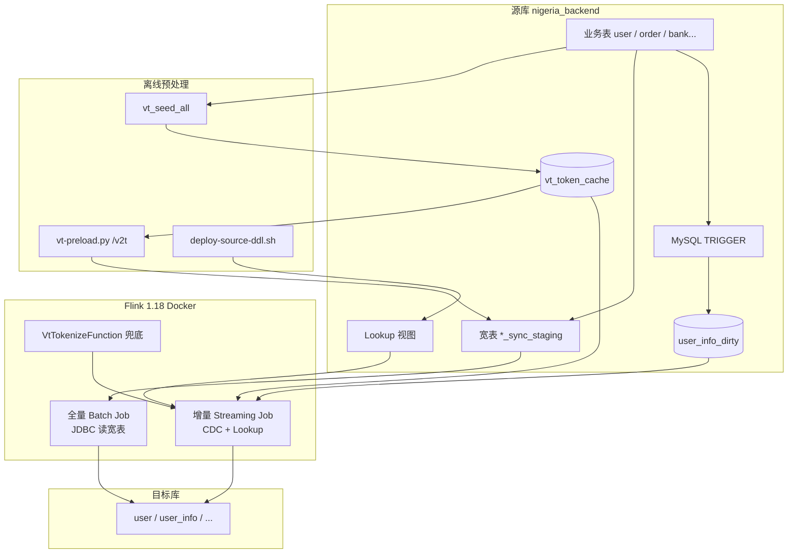

# Nigeria Flink Sync — 实现文档

从原理、架构到具体技术方案的完整说明。字段口径见 [FIELD_MAPPING.md](FIELD_MAPPING.md)；运维见 [MULTI_JOB_SYNC.md](MULTI_JOB_SYNC.md)；VT 见 [VT_PRELOAD_GUIDE.md](VT_PRELOAD_GUIDE.md)；调优见 [PERFORMANCE.md](PERFORMANCE.md)。

---

## 1. 项目目标

将尼日利亚 API 源库 `nigeria_backend` 同步到中台目标库，覆盖 6 张核心业务表：

`user` → `user_info` → `user_bankcard` → `user_product` → `application` → `loan`（+ 可选 `id_mapping`）

核心约束：

- 敏感字段（手机号、BVN、银行卡等）须 **VT 令牌化**，不能明文落目标库
- 源库表多、JOIN 复杂，Flink 不宜在流里做重 JOIN
- 全量（历史）+ 增量（binlog）须衔接，不能丢变更

---

## 2. 总体架构



**设计哲学**：把复杂度和 IO 尽量推到 **MySQL 侧（宽表 + 视图 + VT 字典）**，Flink 只做 **搬运 + 轻量组装**。

---

## 3. 技术栈

| 层级 | 技术 |
|------|------|
| 流引擎 | Apache Flink **1.18**，Table/SQL API |
| CDC | `flink-sql-connector-mysql-cdc` **3.1.1**（Debezium） |
| 读写 | JDBC Connector **3.1.2**，MySQL Driver **8.3** |
| 状态 | RocksDB + 文件系统 Checkpoint（EXACTLY_ONCE） |
| 部署 | Docker Compose（JobManager + TaskManager） |
| 时区 | `Africa/Lagos`（与 binlog 对齐） |
| 自定义 | Java UDF `VtTokenizeFunction`（运行时调 VT `/v2t`） |
| 离线 VT | Python `vt-preload.py` + Shell 流水线 |
| 编排 | Bash（`sync-bulk-auto.sh` / `sync-incr-auto.sh` 等） |

镜像构建见根目录 `Dockerfile`：Maven 编译 UDF → 打入 Flink 镜像，附带 CDC/JDBC/MySQL 驱动 JAR。

---

## 4. 两条同步路径

### 4.1 全量（Bulk）

| 项 | 方案 |
|----|------|
| 模式 | `execution.runtime-mode = batch` |
| 数据源 | **JDBC 读宽表** `*_sync_staging`（不用 CDC，CDC 是无界源） |
| 并行 | `scan.partition.column` 按 `id` / `user_id` 分区读 |
| VT | 宽表里已有 `*_token`；缺失走 **阶段 2** `*_vt_miss.sql` + UDF |
| 监控 | 宽表行数 vs 目标表行数，达标后 Cancel Job |

宽表由 `sql/ddl/source_all_sync_staging.sql` 在 MySQL 内 JOIN 生成，VT token 来自预加载好的 `vt_token_cache`。

典型全量 SQL：`sql/02_sync_user_fast.sql`（阶段 1 有 token）、`sql/02_sync_user_fast_vt_miss.sql`（阶段 2 无 token 调 UDF）。

### 4.2 增量（Incremental）

| 项 | 方案 |
|----|------|
| 模式 | Streaming + Checkpoint |
| 触发 | **MySQL CDC** 监听源表 binlog |
| 组装 | **JDBC Lookup Join** 查 MySQL 视图，取最新整行 |
| VT | 优先 Lookup `vt_token_cache_lookup`；miss 时 UDF 调 `/v2t` |
| 启动 | 默认 `scan.startup.mode=timestamp` + `bulk-start-ms` |

**全量与增量的衔接**：流水线开始时锁定 `bulk-start-ms`（源库 `NOW()` 毫秒时间戳），写入 `logs/bulk-start-ms.env`。宽表重建期间产生的 binlog，由增量 Job 从该时刻起补读，避免丢数。

实现见 `scripts/lib/bulk-start-ms.sh`。

---

## 5. VT（令牌化）方案

VT 已从 Flink 主路径拆出，避免全量时对 `/v2t` 的 HTTP 风暴。

```text
源表明文 → vt_seed_all（INSERT IGNORE 灌明文）
         → vt-preload.py（批量 POST /v2t）
         → vt_token_cache（status=1, token）
         → 宽表 JOIN token
         → Flink 只读 token，不调 HTTP
```

要点：

- `vt_type` 用 **TINYINT**（编码见 `sql/ddl/vt_type_codes.sql`）
- 视图 `vt_token_cache_lookup` 把 TINYINT 映射回字符串供 Flink JOIN
- UDF `VtTokenizeFunction` 仅作 **Lookup miss / 全量阶段 2** 兜底
- 大表无法 `DROP` 时可用 RENAME 换表（`sql/ddl/vt_token_cache_rebuild_swap.sql`）

---

## 6. 各表增量技术方案

| 表 | CDC 源 | 组装方式 |
|----|--------|----------|
| **user** | `user` + `adjust_callback_record` | Lookup `user_incr_lookup` + adjust 视图 |
| **user_info** | **仅** `user_info_dirty`（脏队列） | Lookup `user_info_incr_bundle_lookup` 单次 |
| **user_bankcard** | `user_bank_info` + `vt_token_cache` | Lookup `user_bankcard_incr_lookup` |
| **user_product** | `user_order` | Lookup `user_product_latest_lookup` 取最新一单 |
| **application** | 8 张表 CDC | Lookup `application_order_lookup` 按 order_id 重算 |
| **loan** | 3 张表 CDC | Lookup `user_order_installment_loan_lookup` |

Job 编排见 `config/sync-jobs.conf`。

### 6.1 user_info 脏队列（方案 B）

**问题**：user_info 依赖 9+ 张源表，若 Flink 多路 CDC + 串行 Lookup，极慢且 checkpoint 易超时。

**方案**：

```text
源表变更 → MySQL TRIGGER → user_info_dirty_{0..3}（PK=user_id，user_id%4）
                              ↓
                    Flink 四路 CDC + UNION
                              ↓
              TUMBLE 窗口合并（USER_INFO_DIRTY_COALESCE_SEC，默认 5s）
                              ↓
              JDBC Lookup user_info_incr_bundle_lookup
                              ↓
                    组装 JSON info → sink user_info
```

源表 TRIGGER 与 debounce 存储过程：

| 源表 | debounce | 影响字段 |
|------|----------|----------|
| `user` | 10s | registration_time、app、adid |
| `user_personal_info` | 10s | 姓名、BVN、地址等 |
| `user_work_related` | 10s | job_type、salary 等 |
| `user_emergency_contact` | 10s | emergency_contacts |
| `risk_user_credit_callback` | 30s | credit_limit |
| `vt_token_cache`（id_number / emergency） | 60s | id_number、紧急联系人 mobile |
| `adjust_callback_record` | 60s | install_source |

DDL：

- `sql/ddl/user_info_dirty_enqueue.sql` — 存储过程
- `sql/ddl/user_info_dirty.sql` — 脏表 + TRIGGER

增量 SQL：`sql/02_sync_user_info_incr.sql`

CDC 特殊配置：

- `scan.incremental.snapshot.enabled=false` — 脏表不做全表快照
- `debezium.snapshot.locking.mode=none` — 云 RDS 无 `FLUSH TABLES` 权限
- `CDC_SERVER_ID_UI_DIRTY_0..3` 每片须 **单值** server-id（如 `5401/5411/5421/5431`）
- `USER_INFO_DIRTY_SHARDS=4` 与 Flink 并行度对齐

### 6.2 application / loan 多源 CDC

任一关联表变更 → 按主键（`order_id` / `installment_id`）Lookup 重算整行，保证与全量宽表逻辑一致。

- application：`sql/02_sync_application_incr.sql`
- loan：`sql/02_sync_loan_incr.sql`

---

## 7. 源库 Lookup 视图

由 `./scripts/deploy-source-ddl.sh` 一键部署（无需 DMS 手工建视图）：

```text
sql/ddl/source_views_adjust.sql
sql/ddl/source_lookup_views.sql
sql/ddl/user_info_dirty_enqueue.sql
sql/ddl/user_info_dirty.sql
```

Flink 增量 Job 通过 JDBC Lookup 读这些视图（**唯一 DDL 入口** `sql/ddl/source_lookup_views.sql`）：

| 视图 | 用途 |
|------|------|
| `user_info_incr_bundle_lookup` | user_info 增量唯一 Lookup 入口 |
| `vt_token_cache_lookup` | VT TINYINT → 字符串（bundle 内部 JOIN） |
| `user_emergency_contacts_lookup` | 紧急联系人 mobile token（bundle 内部） |
| `application_order_lookup` | 申请单整行 |
| `user_product_latest_lookup` | 用户最新产品额度 |
| `user_incr_lookup` / `users_by_adid_lookup` | user 增量 |
| `user_bankcard_*` / `user_order_*` | bankcard / loan / application 增量 |

已废弃、可 DROP 的视图见 `sql/ddl/drop_legacy_views.sql`。

**运维注意**：视图依赖 `vt_token_cache` 基表；Flink Job 运行时会对 Lookup 持有 MDL。**Cancel Job 后再做 DDL**。废弃视图清理：`sql/ddl/drop_legacy_views.sql`。

---

## 8. Flink 运行时配置

`docker-compose.yml` 要点：

| 配置 | 值 | 说明 |
|------|-----|------|
| `state.backend` | rocksdb | 大 state 友好 |
| `checkpoint.interval` | 300s | 多 CDC Job 降低频率 |
| `checkpoint.timeout` | 1800s | Lookup 快照期 state 大 |
| `unaligned` | true | 反压时减少 checkpoint 失败 |
| `table.local-time-zone` | Africa/Lagos | 与 binlog 对齐 |

常用环境变量（`.env`）：

| 变量 | 用途 |
|------|------|
| `FLINK_PARALLELISM_BULK` | 全量并行（如 20~40） |
| `FLINK_PARALLELISM_INCR` | 增量并行（建议 4） |
| `FLINK_PARALLELISM_USER_INFO` | user_info 专用（默认 2× INCR，建议 8~12） |
| `FLINK_TASK_SLOTS` | TaskManager slot 总数 |
| `FLINK_TM_MEMORY` | TaskManager 内存 |
| `USER_INFO_DIRTY_COALESCE_SEC` | user_info 脏队列 Flink 侧合并窗口 |
| `CDC_STARTUP_MODE` | `timestamp`（正确）/ `latest-offset`（提速，会丢历史） |
| `CDC_SERVER_ID_*` | 每路 CDC 独立 server-id，避免 binlog 冲突 |
| `VT_BASE_URL` | UDF 兜底调用的 VT 服务地址 |

Slot 峰值估算：

```text
峰值 ≈ FLINK_PARALLELISM_BULK + N个增量Job × FLINK_PARALLELISM_INCR
```

---

## 9. 流水线编排

### 9.1 推荐：两阶段迁移

```bash
./scripts/sync-migrate-auto.sh
# 等价于 sync-bulk-auto.sh → sync-incr-auto.sh
```

| 阶段 | 脚本 | 动作 |
|------|------|------|
| 全量 | `sync-bulk-auto.sh` | DDL → 锁定 bulk-start-ms → VT+宽表 → 各表 `--bulk-only` |
| 增量 | `sync-incr-auto.sh` | 读 bulk-start-ms → DDL → 提交各表 incr Job |

从零重跑：`./scripts/full-rerun.sh`（Cancel → 重建 VT → 清 dirty → bulk → incr）

### 9.2 单 Job 自动化

`scripts/sync-job-auto.sh <job_key>`：单表全量监控达标 → 切增量。

### 9.3 宽表重建

```bash
./scripts/rebuild-all-staging.sh
# vt_seed_all → vt-preload → source_all_sync_staging.sql
```

---

## 10. 正确性 vs 性能

| 场景 | 做法 | 风险 |
|------|------|------|
| 首次切增量 | `timestamp` + `bulk-start-ms` | 慢，但 **对** |
| 全量已覆盖、清积压 | `latest-offset` + `TRUNCATE dirty` | **会丢** bulk-start 后未消费的变更 |
| VT 预加载不足 | 全量阶段 2 走 UDF `/v2t` | 极慢 |
| 验证 | `verify-user-info-reconcile.sh`、`verify-user-info-incr.sh --e2e` | 抽样对账 |

---

## 11. 数据口径

- **金额**：宽表字段后缀 `_minor`，**×100 存 kobo/分**（bigint），Flink 直写目标
- **user_id 偏移**：目标 `user_id = 源 id + 100000000`
- **id_mapping**：宽表展开双向边；增量仍 CDC 宽表（待改多源 CDC）

详见 [FIELD_MAPPING.md](FIELD_MAPPING.md)。

---

## 12. UDF 说明

| 类 | 路径 | 作用 |
|----|------|------|
| `VtTokenizeFunction` | `udf/.../VtTokenizeFunction.java` | 单条 `/v2t`，Lookup miss 兜底 |
| `VtBatchClient` | `udf/.../VtBatchClient.java` | HTTP 批量客户端 |
| `MobileNormalizer` | `udf/.../MobileNormalizer.java` | 手机号规范化 |

SQL 中注册：

```sql
CREATE TEMPORARY FUNCTION vt_tokenize AS 'com.nigeria.flink.udf.VtTokenizeFunction';
```

---

## 13. 验证分层

| 层 | 验证什么 | 方法 | 通过标准 |
|----|----------|------|----------|
| L1 基础设施 | 脏表、TRIGGER、Job | `deploy-source-ddl.sh` + Flink UI | TRIGGER≥14，Job RUNNING |
| L2 触发器 | 源表变更 → dirty | UPDATE 源表后查 dirty | 对应 user_id 有行 |
| L3 组装逻辑 | Lookup 与全量一致 | `verify-user-info-incr.sh` staging_vs_bundle | 显示 match |
| L4 管道 | CDC → Sink | `--e2e` 或 UI Records | 目标字段变化 |
| L5 数据 | 与 bundle 一致 | `verify-user-info-reconcile.sh` | 抽样一致 |

---

## 14. 关键文件索引

| 类型 | 路径 |
|------|------|
| 全量 SQL | `sql/02_sync_*_fast.sql`、`*_vt_miss.sql` |
| 增量 SQL | `sql/02_sync_*_incr.sql` |
| 宽表 DDL | `sql/ddl/source_all_sync_staging.sql` |
| Lookup 视图 | `sql/ddl/source_lookup_views.sql` |
| 脏队列 | `sql/ddl/user_info_dirty.sql`、`user_info_dirty_enqueue.sql` |
| VT | `scripts/vt-preload.py`、`sql/ddl/vt_seed_all.sql` |
| Job 编排 | `config/sync-jobs.conf` |
| Docker | `docker-compose.yml`、`Dockerfile` |
| 运维 | `docs/MULTI_JOB_SYNC.md` |

---

## 15. 一句话总结

**MySQL 负责「算好」**（宽表、VT 字典、Lookup 视图、脏队列 TRIGGER），**Flink 负责「搬」**（全量 JDBC 批读、增量 CDC + Lookup Join），**VT HTTP 尽量离线**，UDF 仅兜底；用 `bulk-start-ms` + `timestamp` CDC 保证全量窗口内的 binlog 不丢。
